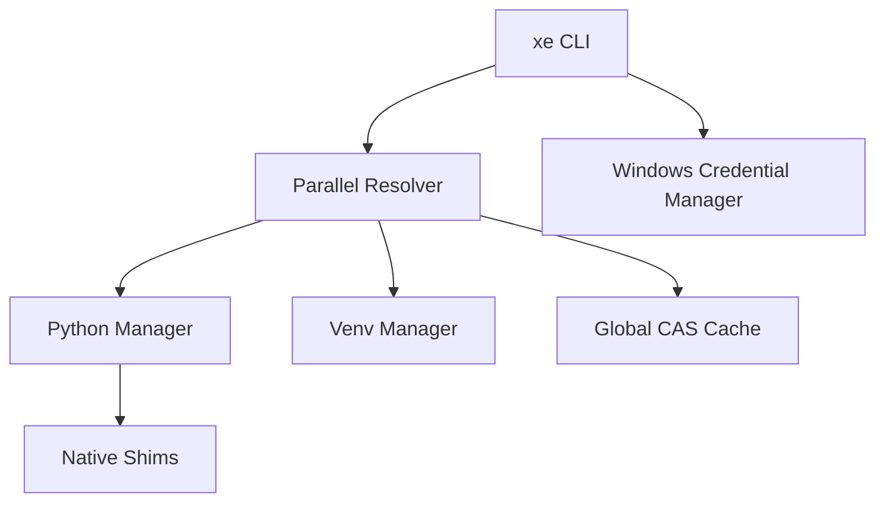

# Architecture & Internals

`xe` is built as a native Go application, optimized for the Windows operating system.

## System Overview

## File System Layout

| Path | Purpose |
| :--- | :--- |
| `~/.xe/bin` | Contains shims for `python`, `pip`, and `xe`. |
| `~/.xe/runtimes` | Installed Python versions. |
| `~/.xe/cache` | Content-addressable wheel cache (SHA-256). |
| `~/.xe/config.yaml` | Global configuration settings. |

## Windows Integration

### Native Shims
Unlike batch-file based shims which can be slow, `xe` generates native `.exe` shims that call the target executable with minimal overhead. This ensures compatibility with all Windows terminals (PowerShell, CMD, Git Bash).

### Security
`xe` does not store plaintext tokens in `.env` or config files. It uses the **Windows Data Protection API (DPAPI)** via the Credential Manager:
- **Service**: `xe-pypi`
- **Target**: `https://upload.pypi.org/legacy/`

This ensures that your credentials are tied to your Windows user account and encrypted at rest.
