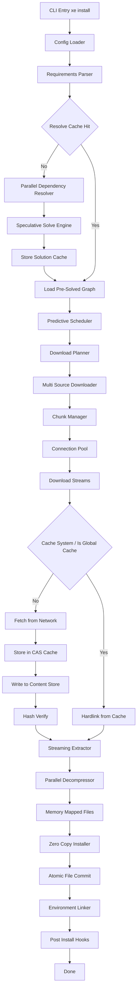

# Architecture & Internals

`xe` now follows a cache-first, no-virtualenv pipeline.

## System Overview

## Key Rules

- One `xe.toml` per project.
- No virtual environments.
- Global, shared CAS cache outside project directories.
- Project runtime exposure is done by wiring `.xe/site-packages` into `PYTHONPATH`.

## Core Components

| Component | Responsibility |
| :--- | :--- |
| CLI layer (`rust/xe_cli`) | Command parsing, UX, orchestration |
| Project config | Load/save `xe.toml`, defaults, dependency map |
| Resolver | Resolve package metadata and dependency artifacts |
| Install engine | Execute solve/download/install pipeline |
| Cache | CAS blobs and solve graph metadata |
| Python manager | Runtime install/discovery and invocation |
| Security | Token save/load/revoke abstractions |

## Install Target Model

- Runtime packages are installed to `.xe/site-packages` per project.
- Global shared cache stores wheel blobs and solve metadata.
- Execution (`xe run`, `xe shell`) injects project package path into process environment.

## File System Layout

| Path | Purpose |
| :--- | :--- |
| `./xe.toml` | Project config and dependency lock surface |
| `./.xe/site-packages` | Project-local installed artifacts |
| `%LOCALAPPDATA%/xe/cache` (Windows) | Global CAS cache |
| `~/.cache/xe` (Linux/macOS) | Global CAS cache |
| `%LOCALAPPDATA%/xe/config.yaml` (Windows) / `~/.local/share/xe/config.yaml` (Linux/macOS) | Global defaults |
