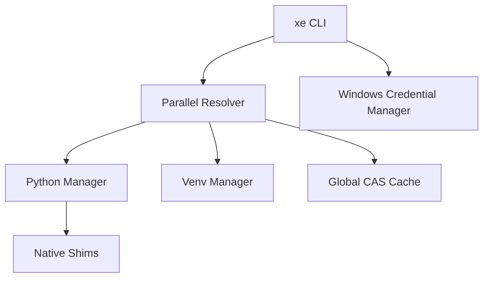

# Architecture & Internals

`xe` is built as a native Go application, optimized for the Windows operating system.

## System Overview

## File System Layout

| Path | Purpose |
| :--- | :--- |
| `~/.xe/bin` | Contains shims for `python`, `pip`, and `xe`. |
| `~/.xe/runtimes` | Installed Python versions. |
| `~/.xe/cache` | Content-addressable wheel cache (SHA-256). |
| `~/.xe/config.yaml` | Global configuration settings. |

## Security

`xe` does not store plaintext tokens in `.env` or config files.

- **Windows**: Integrates with the **Windows Data Protection API (DPAPI)** via the Credential Manager.
- **Linux**: Uses a secure file-based storage in `~/.xe/credentials` with restricted permissions (0600).

This ensures that your credentials are encrypted or restricted to your user account.

## Platform Support

| Platform | Python Storage | Shim Method | Security Native |
| :--- | :--- | :--- | :--- |
| **Windows** | `AppData/Local/Programs/Python` | `.bat` shims | Windows Credential Manager |
| **Linux** | `~/.xe/python` | Shell shims | Restricted file storage |

